# NEXUS GRID Architecture Diagram (Mermaid)

This is a **quick-export Mermaid version** of the production-grade NexusGrid architecture.

- It mirrors the enterprise architecture defined in [nexus-grid-enterprise-architecture.md](C:\Users\saury\Desktop\devpost\docs\nexus-grid-enterprise-architecture.md)
- It is optimized for:
  - fast rendering
  - documentation embeds
  - slide exports
  - quick iteration before or alongside Figma

## Mermaid Diagram

```mermaid
flowchart LR

  %% =========================
  %% Client Layer
  %% =========================
  subgraph CL["Client Layer"]
    WEB["Web Control Room<br/>Next.js / React"]
    MOB["Mobile Ops App<br/>Flutter"]
    ADM["Admin Dashboard<br/>Config / Audit / Models"]
    EXT["External APIs & Partner Integrations"]
  end

  %% =========================
  %% API Layer
  %% =========================
  subgraph API["API Gateway Layer"]
    GW["API Gateway<br/>Kong / AWS API Gateway"]
    AUTH["Auth & Access<br/>OAuth2 / JWT / RBAC"]
    EDGE["REST + GraphQL + WebSocket Edge"]
    RLIMIT["Rate Limiting / Logging / Tenant Routing"]
  end

  %% =========================
  %% Core Services
  %% =========================
  subgraph CORE["Core Services Layer"]
    TWIN["Geo-to-Twin Generation Service"]
    SIM["Simulation Runtime Service"]
    ORCH["Control Orchestrator Service"]
    SIGNAL["Signal Spine Service<br/>Weather / Carbon / Tariff / Telemetry"]
    MARKET["P2P Market Service<br/>Local agent-to-agent energy exchange"]
    SCEN["Scenario & Event Service<br/>Faults / Congestion / Replay"]
    INGEST["Asset Ingestion Service<br/>Overture / OSM / Utility Feeds"]
  end

  %% =========================
  %% AI / ML Layer
  %% =========================
  subgraph AIML["AI / ML Layer"]
    FCST["Forecasting Models<br/>Load / Solar / Carbon / Tariff"]
    LLM["NLP / LLM Services<br/>Operator rationale / reports"]
    RET["Embedding + Retrieval Layer"]
    VISION["Vision / Sensor Intelligence"]
    SERVE["Model Serving Layer<br/>TorchServe / KServe"]
  end

  %% =========================
  %% RL Layer
  %% =========================
  subgraph RL["RL Agents Layer - Adaptive Intelligence Core"]
    DEC["Decision Agent"]
    OPT["Optimization Agent"]
    PRED["Prediction Agent"]
    ENV["Environment Simulator"]
    REWARD["Reward System"]
    TRAIN["Training Pipeline"]
    ONLINE["Online Learning Loop"]
    OFFLINE["Offline Training / Replay"]
    POLICY["Policy Registry & Serving"]
  end

  %% =========================
  %% Data Layer
  %% =========================
  subgraph DATA["Data Layer"]
    PG["PostgreSQL<br/>Relational Ops Data"]
    MONGO["MongoDB<br/>Twin / Scenario / Provenance Docs"]
    REDIS["Redis<br/>Cache / Session / Stream State"]
    KAFKA["Kafka / Event Bus"]
    VECTOR["Vector DB<br/>Pinecone / Weaviate"]
    LAKE["Data Lake<br/>S3 / GCS"]
  end

  %% =========================
  %% Infrastructure Layer
  %% =========================
  subgraph INFRA["Infrastructure Layer"]
    CDN["CDN / Edge Delivery<br/>Cloudflare"]
    LB["Load Balancers"]
    K8S["Docker + Kubernetes"]
    MESH["Service Mesh<br/>Istio"]
    CLOUD["AWS / GCP Multi-Zone Runtime"]
    EDGECOMP["Edge Compute / Regional Runtime"]
  end

  %% =========================
  %% DevOps & Monitoring
  %% =========================
  subgraph OPS["DevOps & Monitoring"]
    CICD["CI/CD<br/>GitHub Actions / Jenkins"]
    PROM["Prometheus + Grafana"]
    ELK["ELK / OpenSearch Logging"]
    ALERT["Alerting / Incident Response"]
    FLAGS["Feature Flags / Progressive Rollouts"]
  end

  %% =========================
  %% Security
  %% =========================
  subgraph SEC["Security Layer (Cross-Cutting)"]
    ZT["Zero Trust Access"]
    TLS["TLS / At-Rest Encryption"]
    IAM["IAM / Secrets / Key Management"]
    APIS["API Security / WAF / Threat Controls"]
  end

  %% =========================
  %% Top-Level Request Flow
  %% =========================
  WEB --> GW
  MOB --> GW
  ADM --> GW
  EXT --> GW

  GW --> AUTH
  AUTH --> EDGE
  GW --> RLIMIT
  EDGE --> TWIN
  EDGE --> SIM
  EDGE --> ORCH
  EDGE --> SCEN

  %% =========================
  %% Core Service Relationships
  %% =========================
  TWIN --> INGEST
  TWIN --> SIGNAL
  TWIN --> MONGO
  TWIN --> PG

  SIM --> MARKET
  SIM --> SIGNAL
  SIM --> SCEN
  SIM --> REDIS
  SIM --> KAFKA

  ORCH --> DEC
  ORCH --> OPT
  ORCH --> PRED
  ORCH --> POLICY
  ORCH --> MARKET

  MARKET --> PG
  MARKET --> KAFKA

  SIGNAL --> KAFKA
  SIGNAL --> REDIS
  SIGNAL --> PG

  INGEST --> MONGO
  INGEST --> LAKE

  %% =========================
  %% AI / ML Flows
  %% =========================
  FCST --> SERVE
  LLM --> SERVE
  RET --> SERVE
  VISION --> SERVE

  SERVE --> ORCH
  SERVE --> EDGE

  RET --> VECTOR
  FCST --> LAKE
  VISION --> LAKE
  LLM --> VECTOR

  %% =========================
  %% RL Core Loops
  %% =========================
  ENV --> REWARD
  REWARD --> TRAIN
  TRAIN --> OFFLINE
  TRAIN --> ONLINE
  OFFLINE --> POLICY
  ONLINE --> POLICY
  POLICY --> DEC
  POLICY --> OPT
  POLICY --> PRED

  SIGNAL --> ENV
  SIM --> ENV
  MARKET --> ENV
  SCEN --> ENV
  PG --> ENV
  MONGO --> ENV
  KAFKA --> ENV

  DEC --> ORCH
  OPT --> ORCH
  PRED --> ORCH

  ORCH --> SIM
  SIM --> KAFKA
  KAFKA --> TRAIN
  LAKE --> TRAIN
  PG --> TRAIN
  MONGO --> TRAIN

  %% =========================
  %% Response Loop
  %% =========================
  SIM --> EDGE
  ORCH --> EDGE
  EDGE --> WEB
  EDGE --> MOB
  EDGE --> ADM

  %% =========================
  %% Infra / Platform Support
  %% =========================
  CDN --> WEB
  LB --> GW
  K8S --> GW
  K8S --> EDGE
  K8S --> TWIN
  K8S --> SIM
  K8S --> ORCH
  K8S --> SIGNAL
  K8S --> MARKET
  K8S --> SCEN
  K8S --> INGEST
  K8S --> SERVE
  K8S --> TRAIN
  MESH --> K8S
  CLOUD --> K8S
  EDGECOMP --> CDN

  %% =========================
  %% DevOps / Observability
  %% =========================
  CICD --> K8S
  PROM --> GW
  PROM --> EDGE
  PROM --> SIM
  PROM --> ORCH
  PROM --> TRAIN
  ELK --> GW
  ELK --> EDGE
  ELK --> SIM
  ELK --> ORCH
  ALERT --> PROM
  ALERT --> ELK
  FLAGS --> EDGE
  FLAGS --> ORCH
  FLAGS --> SERVE

  %% =========================
  %% Security Cross-Cutting
  %% =========================
  ZT -. protects .-> GW
  ZT -. protects .-> EDGE
  TLS -. secures .-> WEB
  TLS -. secures .-> EDGE
  IAM -. governs .-> K8S
  IAM -. governs .-> PG
  IAM -. governs .-> MONGO
  APIS -. defends .-> GW

  %% =========================
  %% Styles
  %% =========================
  classDef client fill:#16233D,stroke:#2C4269,color:#F5F7FA,stroke-width:1px;
  classDef api fill:#102848,stroke:#60A5FA,color:#F5F7FA,stroke-width:1.5px;
  classDef core fill:#13233B,stroke:#4B6B9D,color:#F5F7FA,stroke-width:1.2px;
  classDef ai fill:#102C25,stroke:#34D399,color:#F5F7FA,stroke-width:1.5px;
  classDef rl fill:#23153F,stroke:#A78BFA,color:#F5F7FA,stroke-width:3px;
  classDef data fill:#3A2406,stroke:#F59E0B,color:#F5F7FA,stroke-width:1.5px;
  classDef infra fill:#202A37,stroke:#94A3B8,color:#F5F7FA,stroke-width:1.2px;
  classDef ops fill:#162127,stroke:#7DD3FC,color:#F5F7FA,stroke-width:1.2px;
  classDef sec fill:#35181A,stroke:#F87171,color:#F5F7FA,stroke-width:1.5px,stroke-dasharray: 5 3;

  class WEB,MOB,ADM,EXT client;
  class GW,AUTH,EDGE,RLIMIT api;
  class TWIN,SIM,ORCH,SIGNAL,MARKET,SCEN,INGEST core;
  class FCST,LLM,RET,VISION,SERVE ai;
  class DEC,OPT,PRED,ENV,REWARD,TRAIN,ONLINE,OFFLINE,POLICY rl;
  class PG,MONGO,REDIS,KAFKA,VECTOR,LAKE data;
  class CDN,LB,K8S,MESH,CLOUD,EDGECOMP infra;
  class CICD,PROM,ELK,ALERT,FLAGS ops;
  class ZT,TLS,IAM,APIS sec;
```

## Export Notes

- Best for quick export into:
  - GitHub markdown
  - Notion
  - Mermaid Live Editor
  - slide screenshots
- If you want an SVG fast:
  1. paste the Mermaid block into [Mermaid Live Editor](https://mermaid.live/)
  2. export as `SVG`
  3. use that export in slides, docs, or Canva

## Recommended Usage

- Use the Mermaid version for:
  - technical documentation
  - README architecture sections
  - fast judge-facing visuals
- Use the JSON spec for:
  - polished Figma reconstruction
  - final investor-grade diagram layout
